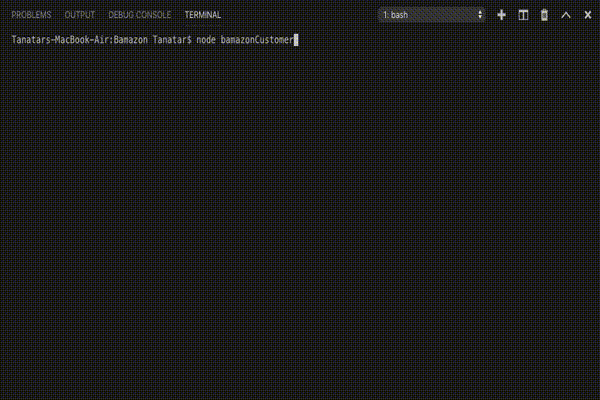
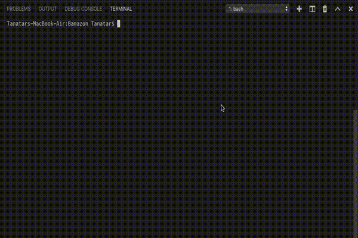

# BAMAZON

## ABOUT

Bamazon is a command line node application using MySQL and npm packages to create an Amazon-like storefront.

### INSTRUCTIONS
* First you need to install and declare your modules
* Connect your MySQL database

```javascript
// DEPENDENCIES
// ====================================================
const mysql = require("mysql");
const inquirer = require("inquirer");
const colors = require("colors");
const Table = require('cli-table3');

// MySQL CONNECTION
// ====================================================
const connection = mysql.createConnection({
    host: "localhost",
    port: "YOUR_PORT",
    user: "YOUR_USERNAME",
    password: "YOUR_PASSWORD",
    database: "bamazon"
});
connection.connect((err) => {
    if (err) throw (err);
    process.stdout.write('\033c\033[3J');
    console.log("APP LAUNCHED".bold.yellow);
    askAction();
});
```

## CUSTOMER'S APP

The customer view of the app takes in orders from users and depletes stock from the store’s inventory. It validates input and will let the customer know if they’ve entered an invalid item ID or if an item is out of stock. If the item is available in the quantity specified, the customer will be given the total price and the inventory will be updated on the backend.

EXAMPLE:



## MANAGER'S APP

The manager view of the app presents the user with a list of set menu options. Depending on the command selected, the app will read and return data to the manager, or prompt the manager for input to update or insert new data into the database. Managers are able to perform the following functions:

* View Products for Sale
* View Low Inventory
* Add to Inventory
* Add New Product

EXAMPLE:

